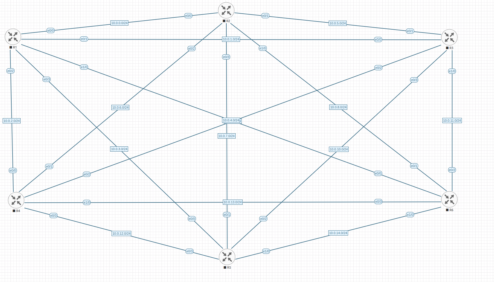
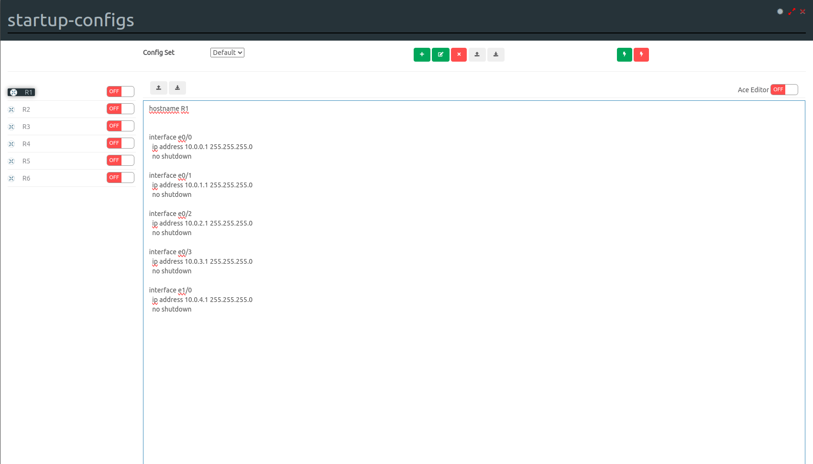

# eve-ng-topology-generator
Provide input for how many routers, their names, and connections, an overall prefix to use for the point to points and the template and image to use in EVE and this should generate a topology for you.

The YAML file will include the router names and their interfaces plus subnets. The UNL file includes a startup configuration with the hostname set and the interface addresses set.

## Things to keep in mind
I've only tested this with IOL templates in EVE and I am only generating startup configs in the IOS fashion.

At some point I will figure out a better way to include more templates and get the interface names set appropriately as well. At this point I am pushing the limits of my abilities to code this, but as I learn I will update. 

## Example inputs
```bash
Enter lab name: test
Enter the router name prefix: R
Enter the number of routers: 6
Is R1 connected to R2? (y/n): y
Is R1 connected to R3? (y/n): y
Is R1 connected to R4? (y/n): y
Is R1 connected to R5? (y/n): y
Is R1 connected to R6? (y/n): y
Is R2 connected to R3? (y/n): y
Is R2 connected to R4? (y/n): y
Is R2 connected to R5? (y/n): y
Is R2 connected to R6? (y/n): y
Is R3 connected to R4? (y/n): y
Is R3 connected to R5? (y/n): y
Is R3 connected to R6? (y/n): y
Is R4 connected to R5? (y/n): y
Is R4 connected to R6? (y/n): y
Is R5 connected to R6? (y/n): y
Enter prefix (e.g., 10.0.0.0/16): 10.0.0.0/16
Enter EVE-NG template (e.g., iol): iol
Enter EVE-NG image (e.g., x86_64_crb_linux-adventerprisek9-ms.bin): x86_64_crb_linux-adventerprisek9-ms.bin
Setting network_id 1 for connection between R1 and R2
Setting network_id 2 for connection between R1 and R3
Setting network_id 3 for connection between R1 and R4
Setting network_id 4 for connection between R1 and R5
Setting network_id 5 for connection between R1 and R6
Setting network_id 6 for connection between R2 and R3
Setting network_id 7 for connection between R2 and R4
Setting network_id 8 for connection between R2 and R5
Setting network_id 9 for connection between R2 and R6
Setting network_id 10 for connection between R3 and R4
Setting network_id 11 for connection between R3 and R5
Setting network_id 12 for connection between R3 and R6
Setting network_id 13 for connection between R4 and R5
Setting network_id 14 for connection between R4 and R6
Setting network_id 15 for connection between R5 and R6
.unl file generated: test.unl
Interfaces for each router:
R1: ['e0/0', 'e0/1', 'e0/2', 'e0/3', 'e1/0']
R2: ['e0/0', 'e0/1', 'e0/2', 'e0/3', 'e1/0']
R3: ['e0/0', 'e0/1', 'e0/2', 'e0/3', 'e1/0']
R4: ['e0/0', 'e0/1', 'e0/2', 'e0/3', 'e1/0']
R5: ['e0/0', 'e0/1', 'e0/2', 'e0/3', 'e1/0']
R6: ['e0/0', 'e0/1', 'e0/2', 'e0/3', 'e1/0']
YAML file generated: test.yaml
```

Current output of the topology when copied to your EVE server



What the startup configuration will look like
